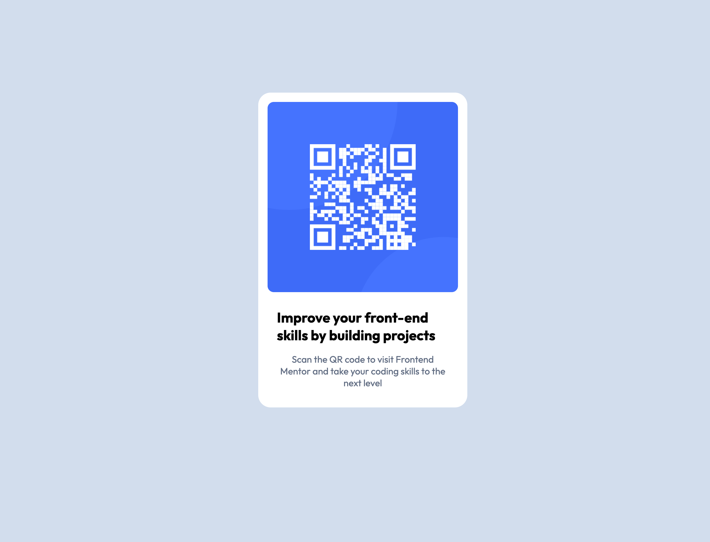

# Frontend Mentor - QR code component solution

This is a solution to the [QR code component challenge on Frontend Mentor](https://www.frontendmentor.io/challenges/qr-code-component-iux_sIO_H). Frontend Mentor challenges help you improve your coding skills by building realistic projects. 

## Table of contents

- [Overview](#overview)
  - [Screenshot](#screenshot)
  - [Links](#links)
- [My process](#my-process)
  - [Built with](#built-with)
  - [What I learned](#what-i-learned)
  - [Continued development](#continued-development)
  - [Useful resources](#useful-resources)
- [Author](#author)
- [Acknowledgments](#acknowledgments)

**Note: Delete this note and update the table of contents based on what sections you keep.**

## Overview

### Screenshot



### Links

- Solution URL: [Add solution URL here](https://your-solution-url.com)
- Live Site URL: [Add live site URL here](https://your-live-site-url.com)

## My process

### Built with

- Semantic HTML5 markup
- CSS custom properties
- Flexbox
- CSS Grid
- Mobile-first workflow

### What I learned

Use this section to recap over some of your major learnings while working through this project. Writing these out and providing code samples of areas you want to highlight is a great way to reinforce your own knowledge.

To see how you can add code snippets, see below:

```html
<h2>Improve your front-end skills by building projects</h2>
```
```css
.description {
  padding: 0 1em;
  margin-bottom: 1em;
}
```
### Continued development

I want to continue practicing to get my hands adapted.

### Useful resources

- [Codecademy](https://www.codecademy.com/resources/docs/css) - This helped me with css knowledge. I really liked this pattern and will use it going forward.
- [Flexbox](https://www.codecademy.com/resources/docs/css/flexbox) - This is an amazing article which helped me finally understood flexbox. I'd recommend it to anyone still learning this concept.

## Author

- Website - [Frank Kodie](https://www.your-site.com)
- Frontend Mentor - [@franklobsty25](https://www.frontendmentor.io/profile/franklobsty25)
- Twitter - [@kodieadu](https://www.twitter.com/kodieadu)

## Acknowledgments

Codecademy
